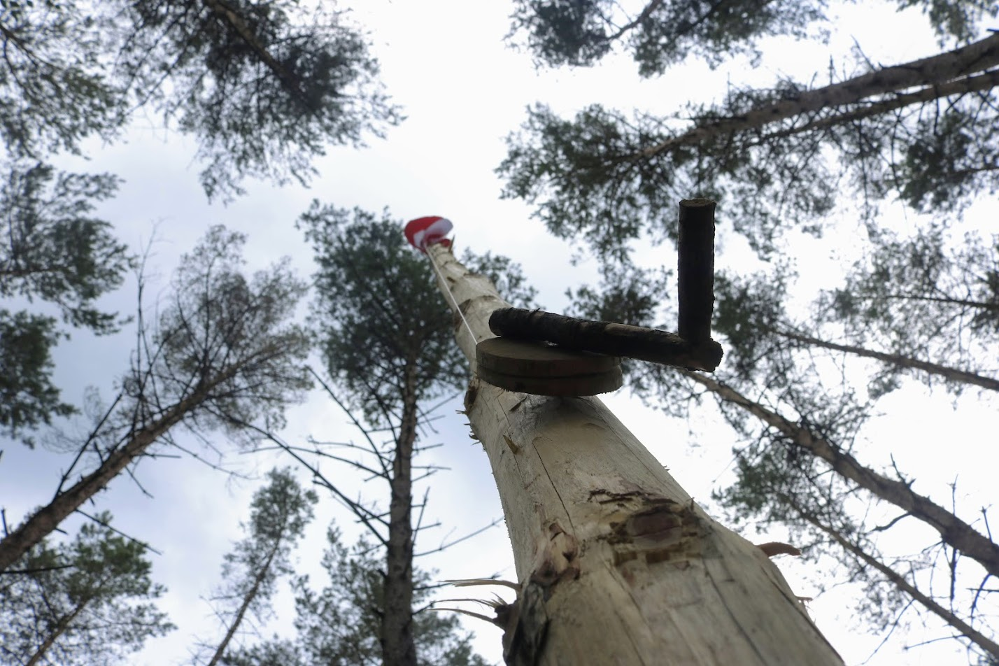

# Obóz 2020

06.07.2020 | Antoni Dąbrowski

Ten obóz miał się diametralnie różnic od reszty. Oczywiście nie mam na myśli tego, że miał być nudny. Wyróżniał się faktem, że był organizowany w trakcie trwania globalnej pandemii. Przez to będziemy musieli ściśle przestrzegać zasad narzuconych nam przez GIS w celu ograniczenia rozprzestrzeniania się wirusa. Poza tym obóz się zapowiada całkiem dobrze. Jedziemy nad jezioro Spore, z trzema drużynami - Bindugą, Watrą i Jedynką. Komendantką jest Marysia (była drużynowa Watry), a wicekomendantem jest Kuba (nasz były drużynowy przed rozbiorami Bindugi). Ten obóz w przeciwieństwie do poprzedniego będzie mieć tematykę, którą mają być Indianie.