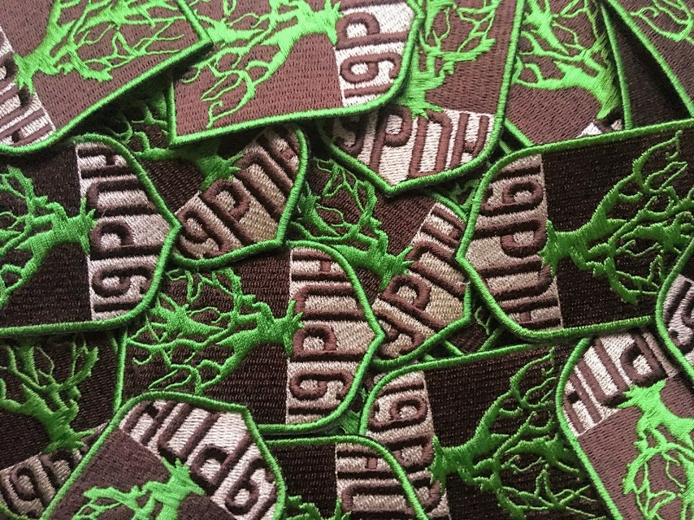

# Plakietki drużyny

12.07.2020 | Franciszek Kieliszewski

Piękne, cudowne, pachnące, staranne, oryginalne. Nasza radość w chwili dostania plakietek była nie do opisania. Niestety nie można takich miłych rzeczy powiedzieć o reakcji na wiadomość o tym, że trzeba je przyszyć jeszcze dziś do śniadania... Nagle znikąd okazało się, że połowa drużyny nie umie szyć. Kiernik przyszył plakietkę do munduru ale niestety przy okazji do własnych spodni. Paweł pożyczył igły od chyba każdego z drużyny i je wszystkie zgubił. W końcu, z lekkimi problemami, każdemu udało się przyszyć plakietkę. Następnym razem jak nas spotkacie to patrzcie na lewe ramię i podziwiajcie 😉.

Projekt plakietki wykonał znajomy wybitny artysta i malarz, były drużynowy Bindugi, a obecnie nasz hufcowy - Jakub Matusewicz.