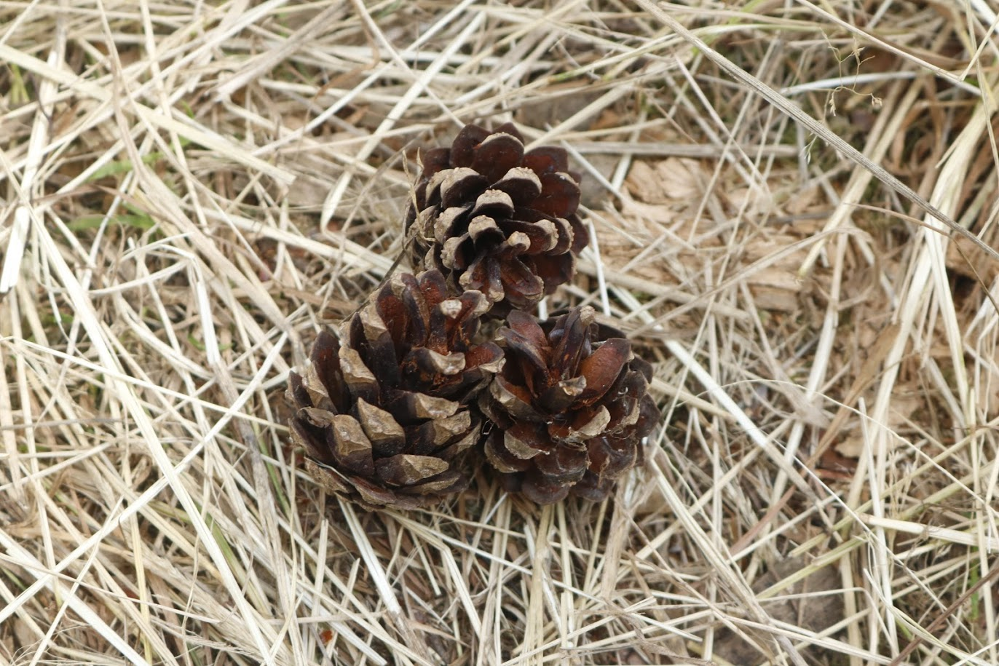
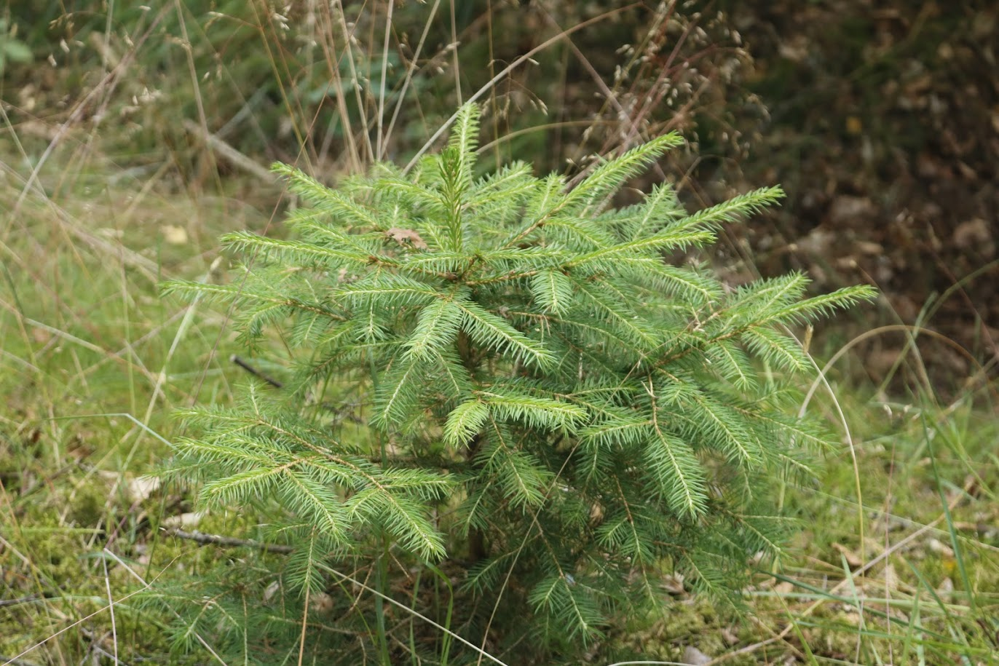
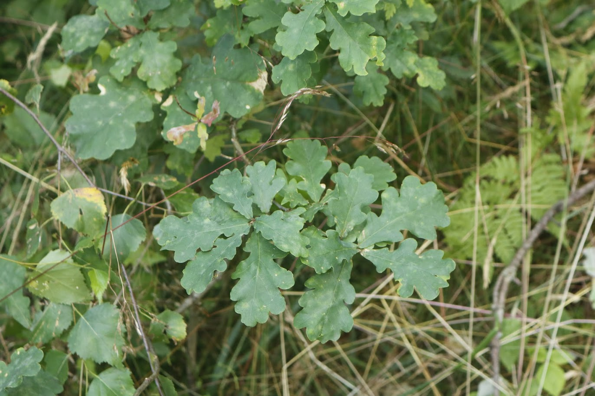
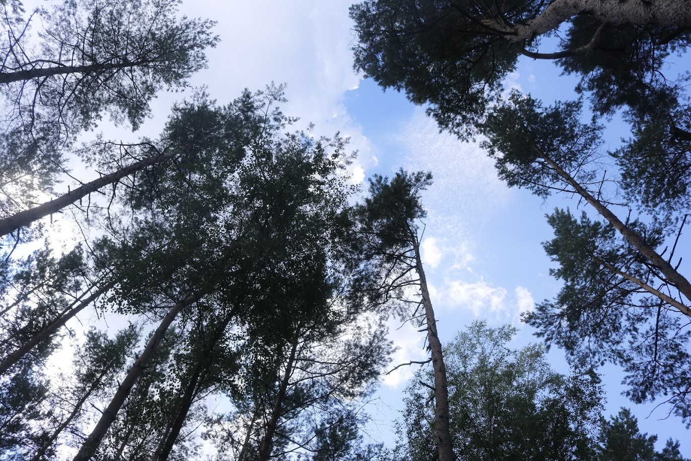

# Przyroda nad jeziorem Sporym

14.09.2020 | Filip Olszewski

Dostałem jako zadanie opis przyrody z tegorocznego obozu. Będzie on napisany w dosyć nietypowy sposób, ponieważ będę opisywał rzeczy, które zrobiliśmy z darów lasu, bądź znaleźliśmy lub zauważyliśmy.

Zacznę od tego, iż na rękodzielnika musiałem przygotować kij proporcowy, czyli oskrobać z kory i oszlifować, aby był piękny i gładki. Było to zadanie proste jak bułka z masłem, może poza czasem, jaki musiałem na nie poświęcić.

Pozostając dalej w temacie drewna było one na obozie bardzo grube przez co nawet krótkie żerdki były ciężkie do przenoszenia. Poza tym często zdarzały się nierówne oraz w finezyjnych kształtach, a co za tym idzie pionierka naszego zastępu wyszła krzywa i stabilna niczym dwója na świadectwie.

Płynnie wracając w tematy rzemiosła Plaster wykonywał bardzo fajne plecione opaski z trawy (tzw. Sity). Były one splecione w sposób podobny do warkocza i wytrzymałe niczym pionierka drugiego próbnego. Niestety po pewnym czasie wysychały oraz zrywały się, ale poza tym jest to kolejny fajny przykład wykorzystania darów lasu.

Kontynuując temat rzeczy z darów lasu jeden druh z naszej drużyny (Józek) zrobił dżem. Co prawda użył do niego dzikiej wuchty cukru, ale pomimo to smakował nieźle (zwłaszcza jak na to, że był w większości zrobiony z darów lasu).

Dalej konsekwentnie pozostając przy darach lasu jedna z naszych kucharek (Emilka) zrobiła herbaty z liści malin i z samych malin (dwa rodzaje). Były one bardzo smaczne oraz miały bardzo fajny aromat, który dodawał im wyrazu.

Zgrabnie przechodząc do meserszmitów (pewnego rodzaju owadów) chciałbym je opisać żeby łatwiej było zrozumieć następny akapit. Meserszmity to są takie podrasowane komary o większych rozmiarach i mocniejszych ugryzieniach co powoduje, iż bardziej przerażają oraz sieją większy zamęt. Do tego czepiają się wszystkiego co staje im na drodze niczym rzep psiego ogona.

Pozostając w temacie meserszmitów mój Drużynowy (Patryk) znalazł “meser-skorpiona”, czyli skrzyżowanie meserszmita i skorpiona. Był on sporych rozmiarów i zaciekle próbował uciec z pudełka po drażach. Próbował się wydostać niczym karetka z korka. W pewnym momencie prawie by mu się udało, ale gdybyśmy nie zareagowali przygniótł by sobie głowę.

Przechodząc do wyglądu można napisać jedynie, że tył miał skorpiona, a przód meserszmita mówiąc zwięźle skorpion ze skrzydłami.

Ten opis jest nietypowy, ponieważ z perspektywy obozowej i z mojej perspektywy.

The End.