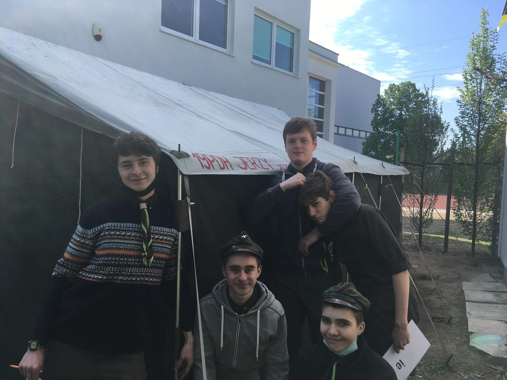
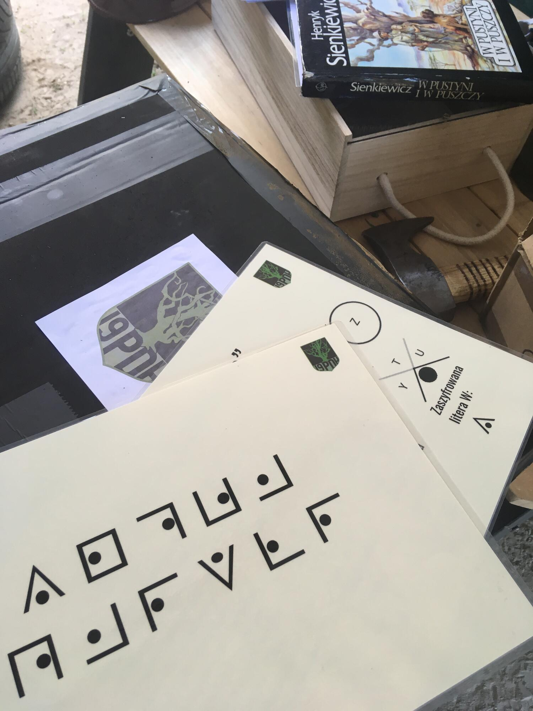

# Nabór

21.05.2021 | Patryk Niedźwiedziński

W piątek 21 maja nasz namiot Jerzy po raz pierwszy stanął na szkolnym gruncie. Wtedy to właśnie zorganizowaliśmy w Piątkowskiej Szkoły Społecznej akcję naborową i grę dla uczniów klas 4-6.

Podczas długiej przerwy, ekipy z każdej z klas musiały odnaleźć ukryte hasła. Na terenie szkoły ustawione było 6 punktów, na każdym z nich jakieś zadanie albo zagadka - kto był kiedyś w escape roomie ten wie o co chodzi.

Po zebraniu wszystkich wskazówek trzeba było podejść do naszego namiotu i odebrać zaproszenie na jutrzejszą zbiórkę.
