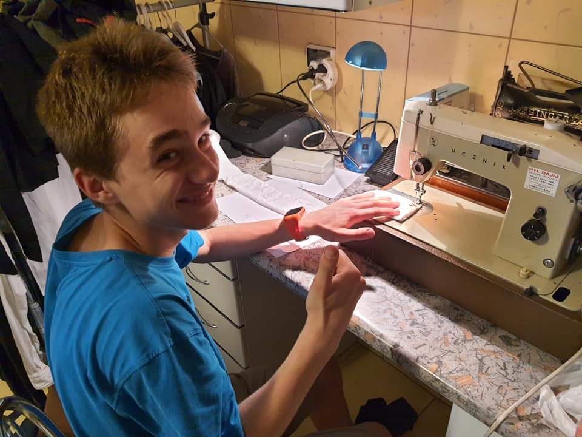

# Szycie

21.05.2021 | Jan Waligóra

"Szycie szycie lubie szycie"
~ Ktoś kiedyś

W zeszły wtorek, w domu jednego z druhów odbyła się zbiórka naszych
ZZ-tów o tematyce krawieckiej! Chłopcy poznawali i doświadczali
procesy stojące za produkcją odzieży maszynowo, po czym byli w
stanie sami wykonać najprostszy jej element - bandanę. Niektórzy
przeszli też przyspieszony kurs obsługi żelazka.

