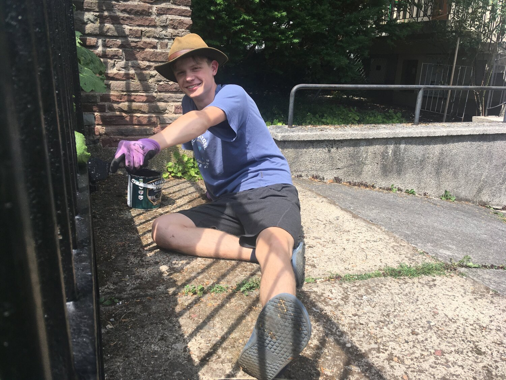
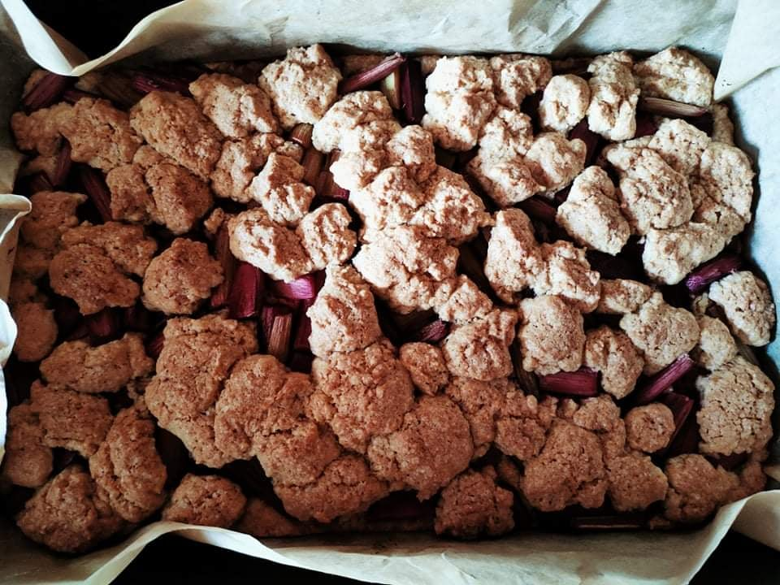
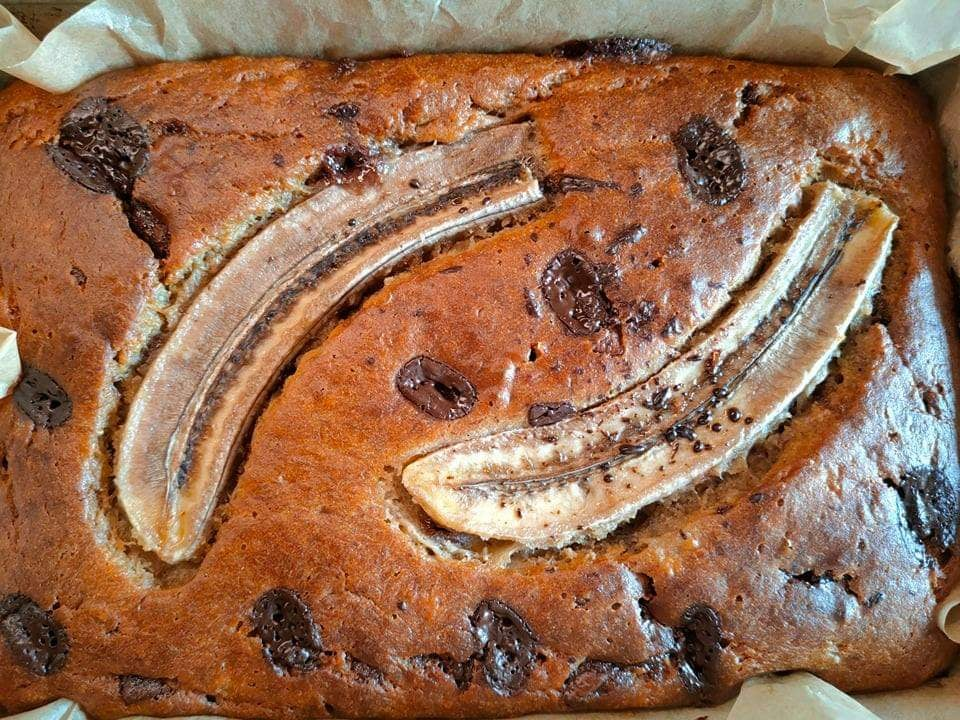

# Praca praca praca

29.06.2021 | Patryk Niedźwiedziński

Lada moment obóz, a gdzie jest sprzęt pionierski? Niby jest, ale wybrakowany...

Jeszcze przed obozem każdy z zastępów (łącznie z komendą) zorganizował akcję zarobkową, aby kupić nowy, własny sprzęt. Zastęp z Kórnika (pomimo niesprzyjającej aury pogodowej) sprzedawał flagi na święto 2 maja. Wydry i III Próbny spróbowali swoich sił w cukiernictwie i sprzedawali swoje wyroby (Kielonowi wyszło mega dobre - wiem bo próbowałem 😉). Za to my komendą w skwarze i upale czerwcowego słońca malowaliśmy płot.

Oto kielonowe wypieki:

