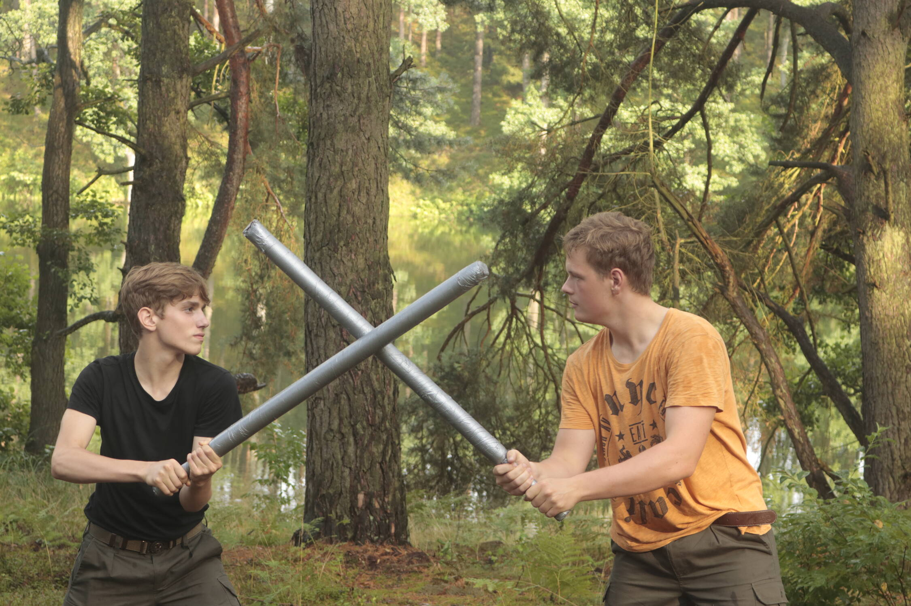

# Złoty smok - Teatr 2021

25.07.2021 | Joda & Kielon

<iframe width="560" height="315" src="https://www.youtube.com/embed/CCzqEstddBQ" frameborder="0" allow="accelerometer; autoplay; encrypted-media; gyroscope; picture-in-picture" allowfullscreen style="width: 100%; height: 50vmin; max-height: 450px; top: 0;"></iframe>

<code>

 
 
 

# "Złoty smok"

Joda & Kielon

 

## SCENA I - KINRIU TAKEMURA

(Bandyci i Kinriu)

**NARRATOR**

> Wychodzą bandyci i siadają w półokręgu

Gdzieś w Japonii, 500 lat temu,
żył najznamienitszy ze wszystkich samurajów - Kinriu Takemura

> W tym czasie na scenę wchodzi Kinriu

Był on tak potężny, że w pojedynkę pokonywał całe oddziały,
nawet nie brudząc się przy tym krwią.
W lewej ręce dzierżył siłę konia,
a w prawej... prawej to sam się bał.
Przechadzał się pewnego dnia wybrzeżem oceanu,
gdy trafił na zgraję bandytów.

**BANDYTA 1**
Jutro przybije tu transport jedwabiu z Chin!
Obłowimy się tak, że nawet dzieci naszych dzieci nie będą musiały pracować!
Czekajcie! Ktoś idzie!
Może uda się go nam skroić.

**BANDYTA 2**
Ale Spock! To jest Kinriu Takemura, nie pokonamy go!

**BANDYTA 1**
Na moje to może być nawet Maryla Rodowicz!
Jest nas (*liczy na palcach*) 1, 2, 3... więcej! Uderzamy!

**BANDYTA 2**
Ale Spock! No i poszedł...

> "Walka"

**KINRIU**
Jesteście już martwi.

> Chowa katanę do pochwy i w tym momencie wszyscy bandyci updają na ziemię

## SCENA II - ATAK

(Kapitan, japońscy żołnierze, posłaniec, mongołowie)

> Żołnierze siedzą z menażkami i jedzą

**NARRATOR**
Tymczasem na wybrzeżu Tsushimy w koszarach japońskiego wojska trwał posiłek.

> Kapitan wstaje

**KAPITAN**
Słuchajcie tempe zbóje!
Zauważyłem, że jak odbiorą wam broń, jesteście całkowicie bezbronni,
dlatego po weekendzie zapisuje was na karate/judo.

**ŻOŁNIERZ 1**
Ale Panie Kapitanie, przecież my po tym kursie będziemy jeszcze bardziej bezbronni niż przed.

**ŻOŁNIERZ 2**
No właśnie, a ja po weekendzie jestem umówiony ze szwagrem na ryby, nie ma opcji.

**KAPITAN**
Bez dyskusji

> Wbiega zziajany posłaniec

**POSŁANIEC**
Panie Kapitanie! Mong... Mongołowie atakują!

**KAPITAN**
Dobrze! Szykujmy się do walki, a do kursów jeszcze wrócimy.

> W tym momencie krzyczący mongołowie wbiegają na scenę i zabijają posłańca
> Żołnierze bronią się przed mongołami
> Najpierw mongołowie ranią kapitana, który upada i odczołgiwuje się z pola walki
> Po chwili reszta żołnierzy już leży pokonana
> Mongołowie wybiegają z dzikim okrzykiem bojowym

## SCENA II i pół - POMOC

(Kinriu, Kapitan)

> Kinriu stoi, a Kapitan czołga się do niego jedną ręką przytrzymując ranę

**NARRATOR**
Tak się szczęśliwie dla Japonii złożyło, że akurat na Tsushimie przebywał Kinriu,
załatwiał tam właśnie sprawy rodzinne.

**KAPITAN**
Pomocy...

**KINRIU**
Zostaw mnie. Nie widzisz że jestem zajęty?

**KAPITAN**
Mongołowie... atakują... Tsushime

> Kapitan traci przytomność
> Kinriu pochyla się nad nieprzytomnym Kapitanem i sprawdza mu puls

**KINRIU**
Hmm.. przeżyje, ale nieźle go urządzili. Może jednak jest tam ktoś warty mojej uwagi

## SCENA III - BATUCHAN

(Kinriu, mongołowie, Batuchan)

**NARRATOR**
Kinriu wyruszył na wybrzeże Tsushimy, nie spiesząc się zbytnio
i ucieszył się na myśl, że gdzieś w tym tłumie czekan na niego godny przeciwnik.

> Wchodzą mongołowie, walka w tle

Pokonywał jednego żołdaka za drugim zatracając się przy tym w swojej próżności i pysze.

Gdy tak walczył spostrzegł wyróżniającą się z tłumu sylwetkę,
nie podobną do zwykłego piechura.

**BATUCHAN**
Ta dostojność bijąca z każdego twojego ruchu,
to musisz być ty, Kinriu Takemura.
Twoja sława dotarła aż do głębokiego kontynentu.
Ja nazywam się Batuchan i to zaszczyt się poznać.

**KINRIU**
Ja ciebie z kolei zupełnie nie kojarzę,
ale możemy się zmierzyć.

> Walka

**NARRATOR**
Rozegrało się wtedy epickie starcie między dzikim przywódcą mongołów,
a dostojnym acz pysznym samurajem.

> Batuchan zostaje powalony przez Kinriu

**BATUCHAN**
Ała! Kurde rzeczywiście! O jezu wszystko mnie boli.

> Kinriu pochyla się nad wijącym z bólu Batuchanem
> Batuchan rzuca piasek do oczy Kinriu

I myk myk, zatrutym nożem pod kolano

Kajko, Kokosz! Wrzućcie go do dziury
i tak nie stanowi już zagrożenia

> Dwóch mongołów wbiega i przenosi Kinriu

Taki sławny a taki głupi
Cała jego wielkość się na nim **skupi**.

## SCENA IV - AGONIA

(Kinriu, pastuszkowie)

**NARRATOR**
Ten sam Kinriu Takemura, którego bała się cała Japonia,
leży teraz pokonany i myśli tylko o własnej śmierci.

**KINRIU**
Trzeba spisać ostatnią wolę.

> Zaczyna pisać

Mgła gęsta jak mleko

**PASTUSZEK 1**
Łobudził się w Pany połeta?

**KINRIU**
Mhm, chcesz usłyszeć fraszkę?

Batuchan, Batuchan, ty zbóju...

**PASTUSZEK 2**
Ło to on tak Pana urządził?
Jak spać żeśmy się kłodli, tośmy łune łobaczyli
iśmy się łokrutnie się wystraszyli.
Jednak jak żeśmy łobaczyli te dziure,
to ciekawość wzięła góre.

**KINRIU**
Już nasyciliście swą ciekawość?
Znikajcie stąd!

**PASTUSZEK 3**
Pan na łokrutnie strutego wygląda!
Ale nie ma na świecie takiej choroby,
której by cosik Japońskiego łoscypka nie wyleczył
Hajza bracie po łoscypka!

**PASTUSZEK 4**
Ino raz!

> Przynosi oscypka i daje Kinriu

**KINRIU**
Weźcie ode mnie to paskudztwo! Niemiłosiernie śmierdzi.

**PASTUSZEK 4**
Ino się Pan łoboczy , na nogach stać Pan będzie!

> Kinriu mdleje

**PASTUSZEK 1**
No i zasnął. Dokończcie go łoscypkiem karmić i go zabieramy do chaty.

## SCENA V - PASTUSZKOWIE

(Pastuszkowie i Kinriu)

> Pastuszkowie opatrują Kinriu

**NARRATOR**
Nasz bohater spędził 4 dni i 4 noce
nieprzytomny w chacie pastuszków
leczony tylko im znanymi sposobami.
Gdy przejżeli jego rzeczy i dowiedzieli się, że jest Samurajem
zlękli się na myśl o tym,
że może czekać ich kara
za uprowadzenie podwładnego jednego z wojujących lordów.
Jednak z dnia na dzień coraz bardziej pragnęli zostać takimi jak on.

**KINRIU**
> Budzi się

Gdzie ja jestem? Kurde, przepadły mi dni na snapie z Samurajem Jackiem!

**PASTUSZEK 3**
Ło Maryjko przenajświętsza! Łobudził się!

**KINRIU**
Co się ze mną stało?

**PASTUSZEK 1**
Łokrutnie ktoś Pana struł! 4 doby Pan leżał!

**PASTUSZEK 2**
Jak się Pan czuje?

**KINRIU**
Nie rozmawiam z tobą chamie! Daj mi mój miesz i wychodzę!

> Próbuje wstać, ale pastuszkowie go powstrzymują

**PASTUSZEK 3**
Proszę sobie dać na wstrzymanie. Zresztą... uratowaliśmy Panu życie.

**PASTUSZEK 4**
A co z nagrodą?

**KINRIU**
Mówcie co chcecie i znikajcie mi z oczu.

**PASTUSZEK 1**
Chcemy być samurajami jak Pan!

**KINRIU**
Na to (*wstaje*) nigdy się nie zgodzę

> Kuśtykając odchodzi

## SCENA V i pół - TAJEMNICZY STARUSZEK

(Kinriu, starzec)

**NARRATOR**
Opuścił Kinriu Takemura pastuszkową chatę
i kuśtykając odszedł w tylko sobie znanym kierunku.
Lecz nie zaszedł daleko,
bo zatrzymał go tajemniczy staruszek.

**STARZEC**
Poczekaj młodzieńcze! Po twoim kroku miarkuje,
że ktoś zadał Ci paskudną ranę.
Pewnie wracasz z ataku na wybrzeże Tsushimy.
Ludzie mówią, że to straszna rzeź była.

**KINRIU**
Co ci do tego?

**STARZEC**
Nigdy nie pokonasz Batuchana w pojedynkę,
powinieneś wziąć pod opiekę tych pastuszków,
w końcu uratowali tobie życie.
Do Kioto nie wrócisz - mongołowie zajęli wszystkie porty.

**KINRIU**
Skąd to wiesz? Kim ty w ogóle jesteś?

**STARZEC**
Byłem znany pod wieloma imionami,
jednak żadne z nich nie jest teraz ważne.
A teraz śpij Kinriu waleczny
i zastanów się czy chcesz podopiecznych

**NARRATOR**
I zapadł Kinriu Takemura w sen jakby rażony piorunem.
Miał snów i wizji wiele,
lecz nie rozumiał ich sensu i celu.
Błądził w tych myślach,
aż w końcu zaczęło mu dzwonić.
Nie wiedział jednak w jakim kościele.
Gdy się obudził, wstał z mocnym postanowieniem.

> Kinriu wstaje

**KINRIU**
Zaczekajcie! Zaczekajcie!

## SCENA VI - TRENING

(Pastuszkowie, Kinriu, posłaniec)

> Pastuszkowie w judogach wchodzą na scenę, trenują judo i walkę mieczem

**NARRATOR**
Tak właśnie rozpoczął się trening elitarnego oddziału Kinriu.
Kolejne dni byli pastuszkowie spędzali na ćwiczeniach siłowych,
walce mieczem i szkoleniu się w sztukach walki.
Takemura kładł również nacisk na poprawną wymowę, bo jak sam mawiał:

**KINRIU**
Dworska maniera jest ważna jak cholera.

**NARRATOR**
W międzyczasie przyszła do Kinriu depesza
o rosnącym apetycie mongołów na podboje.

> Wbiega posłaniec z listem, wręcza Kinriu i wybiega

Według informacji zwiadowców pół roku miały zająć im przygotowania do oblężenia Kioto.
Tyle też czasu mieli podopieczni legendarnego samuraja na szkolenie.

## SCENA VII - ODPRAWA

(Pastuszkowie, Kinriu)

**NARRATOR**
Kiedy zadany czas się skończył,
Kinriu zwołał swoich podkomendnych,
aby przedstawić im plan działania.

**KINRIU**
Nasz plan podzieliłem na 3 fazy, tak zwane fifty-fifty.
Celem jest Batuchan...

**PASTUSZEK 1**
A to nie on Cię pokonał mistrzu?

**KINRIU**
Po pierwsze to było dawno,
a po drugie nie pokonał,
tylko użył niehonorowego podstępu,
więc się nie liczy,
W każdym razie:
- faza 1: Infiltracja - wchodzimy do obozowiska mongołów przebrani za ministrantów z kolendą
- faza 2: Dekonspiracja - gdy wejdziemy do namiotu, ściągamy przebrania
- faza 3: Starcie - pokonujemy zaskoczoną straż i samego Batuchana
- i faza 4: Zwycięstwo - wychodzimy z pokonanym Batuchanem z namiotu, odbieramy kapitulacje i słuchamy jak wszyscy mnie... jak wszyscy nas chwalą

**PASTUSZEK 2**
Jak mistrz coś powie to nie ma zbója we wsi

**NARRATOR**
Jak stali tak poszli

## SCENA VIII - KOLĘDA

(Pastuszkowie, Kinriu, mongołowie, więzień)

**NARRATOR**
Tak właśnie w życie weszła 1 faza tajnego planu.
Kinriu wraz ze swoim oddziałem wyruszył zinfiltrować obóz wroga.

> Wchodzą pastuszkowie śpiewając kolędę

**KINRIU**
Kolęda!

**MONGOŁ**
Zapraszamy

**WIĘZIEŃ**
O! To wielki Kinriu, przyszedł nas uratować!

**PASTUSZEK 3**
Wiedziałem, że się nie uda.

**MONGOŁ**
Brać ich!

> Zaczyna się walka

**PASTUSZEK 1**
Idźcie dalej, my ich zatrzymamy

**NARRATOR**
Kinriu ruszył dalej zostawiając za sobą drogich sobie wychowanków,
bo wiedział, że Batuchan nie będzie czekał na niego wiecznie.

## SCENA IX - OSTATECZNE STARCIE

(Kinriu, Batuchan, Pastuszek, Mongoł)

> Kinriu wychodzi zza kurtyny
> Pastuszek zaczyna się skradać wzdłuż widowni

**KINRIU**
Czuwaj!

**BATUCHAN**
Kinriu Takemura!

Chciałbym powiedzieć, że się tego nie spodziewałem,
ale się tego spodziewałem.
Twoja arogancja przegięła pałę gorzyczy.

**KINRIU**
Czarę

**BATUCHAN**
No mówię, przegiąłeś.

**KINRIU**
Nie, ale... nieważne, walczmy.

> Rozpoczyna się epicka scena walki
> Kinriu ostatecznie wybija miecz z rąk Batuchana i powala go na ziemię

**KINRIU**
I co teraz zrobisz? Wyślesz jakiegoś żołdaka by wbił mi miecz w plecy?

**BATUCHAN**
Nie głupie.

> Wyskakuje mongoł od tyłu na Kinriu, ale wtedy podnosi się pastuszek i blokuje cios

**KINRIU**
Jakieś ostatnie słowa?

**BATUCHAN**
Nawet kilka...
o historii co lubi zataczać koła,
może ciągnąć się jakk linia,
lub być jeszcze inna zgoła.
Może również być splątana,
taka właśnie jak ta twoja.
Ty wróciłeś tu silniejszy,
lecz nie w mięśnie ale w cnotę,
obroniłeś swą krainę,
teraz ze mną skończ robotę.
Wszelką chwałę tobie zwracam,
wiesz jak smakuje zwycięstwo,
bo wiesz jak smakuje praca.

**NARRATOR**
Tym oto sposobem zakończyła się inwazja mongołów
Najeźdźcy po złożeniu broni odpłynęli ku kontynentowi
Kinriu zaś uczył dalej nowych samurajów,
a po jego śmierci to oni kontynuowali jego dzieło
i szkolili nowych obrońców Japonii.
Tak się działo z pokolenia na pokolenie,
a teraz na nas spadło to brzemię
opowiedzieć z morałem na ustach
nie ma żadnego mistrza bez ucznia.
</code>
