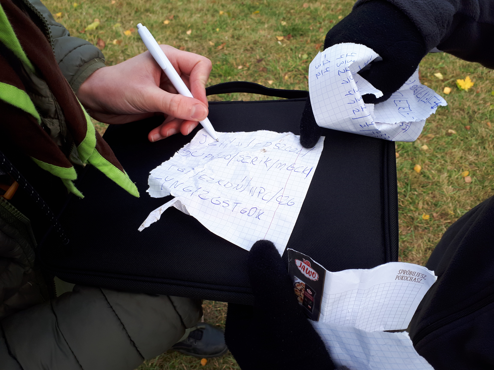

# Zbiórka drużyny 6.11.2021

06.11.2021 | Józek Rumatowski

W sobotę 6 listopada, o godzinie 11:00, nasza drużyna spotkała się, aby korzystać z ostatnich promieni słońca. Podczas zbiórki rywalizowały ze sobą trzy zastępy: V próbny, IV próbny i Wilki. Gra toczyła się na terenie amfiteatru na Cytadeli. Podczas niej miały miejsca epickie pojedynki, porażki, zwycięstwa i ucieczki. Oprócz tego zastępy mogły odświeżyć sobie szyfry. Podczas odczytywania wyników, napięcie osiągnęło apogeum. Wygrał zastęp IV próbny z 13,5 punktami pod przewodnictwem Pawła "Fastła" Appelta. Niestety, na zbiórce zabrakło prawie połowy drużyny z powodów chorobowych, lecz mimo to dobrze się bawiliśmy.

